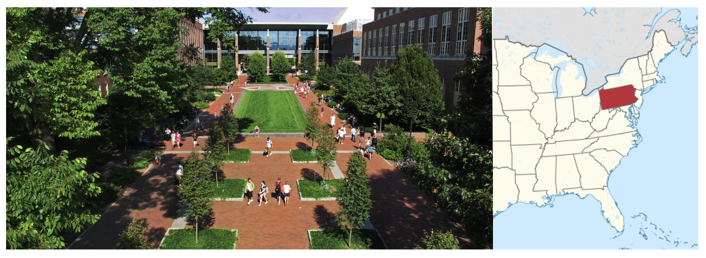

```{r setup, include=FALSE}
knitr::opts_chunk$set(echo = FALSE)

library(tidyverse)
library(knitr)

```


# What perspective do I offer?


# Originally trained as a Statistician

{ width=90% }

# Industry Stint (9 yrs)[^1]

{ width=80% }

- ECL; RD&E; Staff Statistical Consulting
- MDT1; Quality/Reg/R&D; non-Clinical
- Nonin; lead (only) statistician
- MDT2; lame duck session

[^1]: Image credits, clockwise from top left: Kennedy, P., (6 Feb 2023), Ecolab now selling products at Home Depot-the first time available at retail stores, Star Tribune ; Medtronic Operational Headquarters, https://asiapac.medtronic.com/xp-en/about.html ; Rogers, G., (9 Apr 2018), World’s smallest battery-powered implant treating back pain, 9 News ; Lee, E., (4 Oct 2022), The Best Pulse Oximeter for Home Use, New York Times Wirecutter.

# Penn State Department of Statistics 

{ width=100% }

- Director of Undergraduate Programs Statistics & DS
- Founder of SDSE Research Lab
- CAUSE Director

# References 

\tiny


# Thank You


\titlepage


Resource Page: https://mdbeckmantemp.github.io/NZSA-Seminar/


